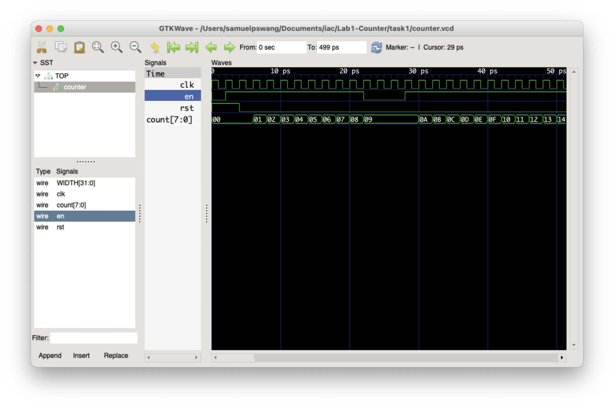
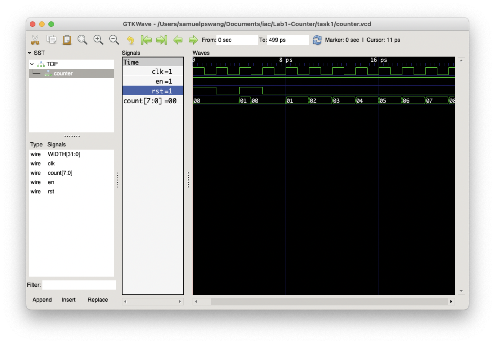

# Task 1 Log

## Task

**Basic Info**

* Date: 20/10/2022
* Author: Samuel Wang
* Objective:
    * Design counter in SystemVerilog. (Completed)
    * Write testbench for counter in C++. (Completed)
    * Run verilator translate & build functions. (Completed)
    * View result in gtkWave. (Completed)
    * Create `doit.sh` for quick build of verilator files. (Completed)
* Others:
    * Added `.gitignore` to avoid pushing large binary files.
    * Logged process in `README.md`.

**Results**

See Verilator simulation outcome in screenshot below. Simulation behaved as expected.

> Note: 1st cycle is Cycle 0.

|  |
| :--: |
| Figure 1: Task 1 Result |


## Test Yourself Challenge

### Challenge 1: Pause-in-Counting

To implement the pause in counting, two additional variables were introduced in the testbench: `stop` for the number to stop, and `itv` for the interval of the stop. Testbench is re-written to note that when stop is reached, it will switch `en` off for 3 cycles. See Figure 2 for result.

|  |
| :--: |
| Figure 2: Pause-in-Counting Result |

### Challenge 2: Asynchronous Flip-Flop

To implement the asynchronous reset, a `posedge rst` detection is added to the flipflop. Line 11 now looks like:

```verilog
always_ff @ (posedge clk, posedge rst)
```

The `rst` signal is set to true at cycle 0 and cycle 2. The `en` signal is set to true at all times. The simulation behaved as expected, cycle 2 of Figure 3, output signal `count` changed before the next positive edge of the `clk`.

|  |
| :--: |
| Figure 3: Asynchronous Flip-Flop Result |


