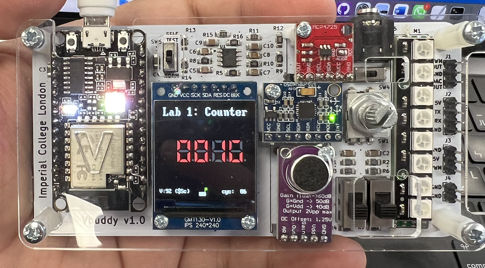
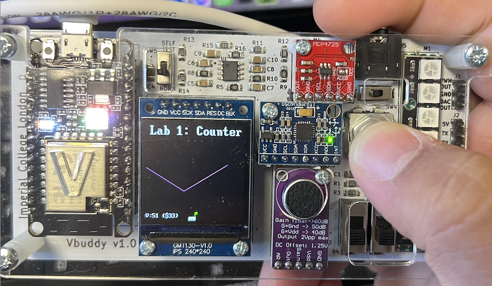

# Task 2 Log

## Task

**Basic Info**

* Date: 21/10/2022
* Author: Samuel Wang
* Objective:
    * Connect laptop to vBuddy. (Completed)
    * Test switching counter enable with rotary switch push button. (Completed)
    * Test two displays, 7-segment display and plot, on vBuddy. (Completed)
* Others:
    * Modified `build.sh` and added `run.sh` for quick access to commands.
    * Added `.gitignore` to avoid pushing large binary files.
    * Logged process in `README.md`.

**Result**

vBuddy and testbench behaved as expected. Observations:

* 7-segment Display
    * Numbers displayed in hexadecimal.
    * When pushed, numbers increase.
    * When pushed again, numbers stay static until stop.
    * See Figure 1 below.
    
* Plot
    * Flat line until button pushed.
    * After pushed, line goes up in slope 1.
    * Fits the description of adding 1 per cycle.
    * See Figure 2 below.

|  |
| :--: |
| Figure 1: vBuddy 7-Segment Display |

|  |
| :--: |
| Figure 2: vBuddy Plot Display |

> Note 1: `>>` is the bitwise shift operator. E.g. `num >> 4` is num right shift by 4 digits.

> Note 2: `&` is the bitwise AND operator. E.g. `(num) & 0xF` gives you the last four digits, as `0xF` is `0000 1111`.


## Test Yourself Challenge

### Challenge 1: Button-For-Up-Down-Count

To implement the challenge, what is written to the `count` output signal is changed. If `en` is 1, `count` will be written as (`count`+1). If `en` is 0, `count` will be written as (`count`-1). See below for code snippet.

```verilog
count <= (en ? count + {{WIDTH-1{1'b0}}, {1'b1}} : count - {{WIDTH-1{1'b0}}, {1'b1}});
```

The design was built and ran, which behaved as expected. See Figure 3 for results. The vBuddy plot display clearly shows an up/down change in the count.

|  |
| :--: |
| Figure 3: Button-For-Up-Down-Count Challenge Result |
