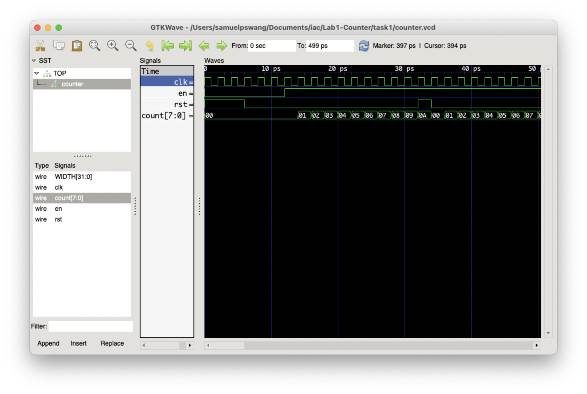

# Task 1 Log

## Task

**Basic Info**

* Date: 20/10/2022
* Author: Samuel Wang
* Objective:
    * Design counter in SystemVerilog. (Completed)
    * Write testbench for counter in C++. (Completed)
    * Run verilator translate & build functions. (Completed)
    * View result in gtkWave. (Completed)
    * Create `doit.sh` for quick build of verilator files. (Completed)
* Others:
    * Added `.gitignore` to avoid pushing large binary files.
    * Logged process in `README.md`.

**Results**

See Verilator simulation outcome in screenshot below. Simulation behaved as expected.

> Note: 1st cycle is Cycle 0.

## Test Yourself Challenge

To-Be-Done

